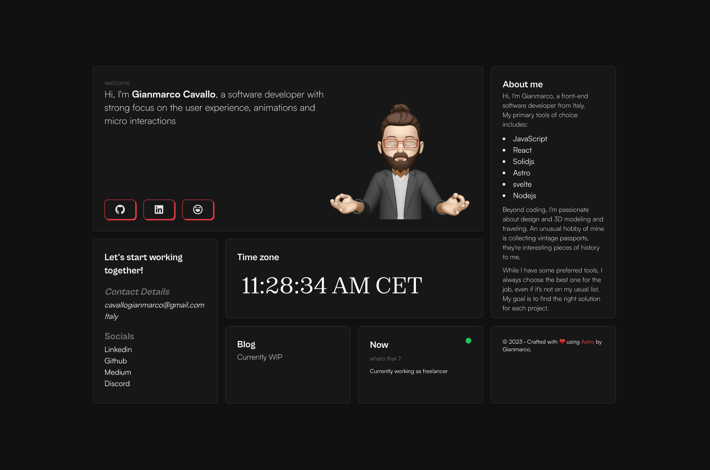

# ⚡️astro-bento-portfolio

## A personal portfolio website made using `Astro`.



To view a demo example, **[click here](https://sparkly-speculoos-0c9197.netlify.app/)**

or my portfolio **[click here](https://gianmarcocavallo.com)**

## Features

- Modern and Minimal bento-like, sleek UI Design
- All in one page (almost)
- Fully Responsive
- Performances and SEO optimizations
- Ready to be deployed on [Netlify](https://www.netlify.com/)
- Blog
- RSS support (your-domain/rss.xml)
- Cool 3d globe

## Tech Stack

- [Astro](https://astro.build)
- [unocss](https://unocss.dev/)
- [motion](https://motion.dev/)
- [d3](https://d3js.org/)

# Steps ▶️

```bash
# Clone this repository
$ git clone https://github.com/Ladvace/astro-bento-portfolio
```

```bash
# Go into the repository
$ cd astro-bento-portfolio
```

```bash
# Install dependencies
$ pnpm install
or
$ npm install
```

```bash
# Start the project in development
$ pnpm run dev
or
$ npm run dev
```

# Be sure to replace the momoji and all the relative information, such as email, website and other info, if you don't your website is gonna point to my domain and to my info

## REMOVE THE umami analytics script tag (or replace it with your id) in `src/layouts/Layout.astro`

# Configuration

remember to replace the `site` and other properties with your data in `astro.config.mjs`

# Deploy on Netlify 🚀

Deploying your website on Netlify it's optional but I reccomand it in order to deploy it faster and easly.

You just need to fork this repo and linking it to your Netlify account.

or

[](https://app.netlify.com/start/deploy?repository=https://github.com/Ladvace/astro-bento-portfolio)

## Authors ❤️

- Gianmarco - https://github.com/Ladvace

## Worktime Logging (Optional)

Legacy worktime totals live in `src/data/worktime.json`. New device-level data lives in:

- `src/data/worktime-sources/macmini.json`
- `src/data/worktime-sources/mbp.json`

The Worktime card treats the legacy file as the macmini fallback, then adds MBP data when available. If `macmini.json` has a date, it overrides the legacy macmini value for that date.

Common commands:

```bash
# Manual log (hours)
pnpm log:worktime 9

# Log yesterday
pnpm log:worktime 9 --yesterday

# Log a specific date
pnpm log:worktime 9 --date 2026-02-07

# Manual device log
pnpm log:worktime 2.5 --date 2026-04-28 --device mbp

# Read today from ActivityWatch, overwrite macmini's device value, then upload
pnpm log:worktime:macmini

# On MBP, check 09:00-23:59, sync once per day, and backfill the last 7 completed days
pnpm log:worktime:mbp

# Custom flags (example: dry run, no write)
node scripts/log-worktime-auto.mjs --device mbp --yesterday --lookback-days 7 --force --dry-run

# Show missing dates between the first logged day and today
pnpm log:worktime 9 --backfill

# Test ActivityWatch connectivity/data
pnpm log:worktime:test --yesterday
```

Notes:
- `--backfill` only reports missing dates; it does not fill them.
- `--device NAME` writes `src/data/worktime-sources/NAME.json`.
- Device logs overwrite the device's value for a date by default. This keeps repeated syncs idempotent.
- `--add` is still available for manual legacy use, but it is not recommended for multi-device automation.
- `--rebase` is recommended before `--push`.
- `deploy.yml` also runs daily at 00:10 Asia/Shanghai so the Worktime wall date window advances even without code changes.
- If your schedule is `00:00` and you want the previous day (for example run at `2026-02-11 00:00` but write `2026-02-10`), use `--yesterday`.
- Recommended workflow: macmini runs once per night; MBP runs hourly after 09:00 but only syncs once successfully per day. MBP syncs completed days through yesterday, so it does not publish partial data for the current day.

macOS daily automation (`launchd`) example (macmini):

```bash
cat > ~/Library/LaunchAgents/io.februarysea.worktime-auto.plist <<'PLIST'
<?xml version="1.0" encoding="UTF-8"?>
<!DOCTYPE plist PUBLIC "-//Apple//DTD PLIST 1.0//EN" "http://www.apple.com/DTDs/PropertyList-1.0.dtd">
<plist version="1.0">
<dict>
  <key>Label</key>
  <string>io.februarysea.worktime-auto</string>
  <key>ProgramArguments</key>
  <array>
    <string>/opt/homebrew/bin/node</string>
    <string>/Users/februarysea/Documents/februarysea.github.io/scripts/log-worktime-auto.mjs</string>
    <string>--device</string>
    <string>macmini</string>
    <string>--commit</string>
    <string>--push</string>
    <string>--rebase</string>
  </array>
  <key>WorkingDirectory</key>
  <string>/Users/februarysea/Documents/februarysea.github.io</string>
  <key>StartCalendarInterval</key>
  <dict>
    <key>Hour</key>
    <integer>23</integer>
    <key>Minute</key>
    <integer>55</integer>
  </dict>
  <key>StandardOutPath</key>
  <string>/tmp/io.februarysea.worktime-auto.log</string>
  <key>StandardErrorPath</key>
  <string>/tmp/io.februarysea.worktime-auto.err.log</string>
</dict>
</plist>
PLIST

launchctl bootout gui/$(id -u) ~/Library/LaunchAgents/io.februarysea.worktime-auto.plist >/dev/null 2>&1 || true
launchctl bootstrap gui/$(id -u) ~/Library/LaunchAgents/io.februarysea.worktime-auto.plist
launchctl enable gui/$(id -u)/io.februarysea.worktime-auto
```

MBP automation can use the same script with these extra flags:

```bash
node scripts/log-worktime-auto.mjs \
  --device mbp \
  --yesterday \
  --lookback-days 7 \
  --once-per-day \
  --start-hour 9 \
  --end-hour 23 \
  --commit \
  --push \
  --rebase
```
